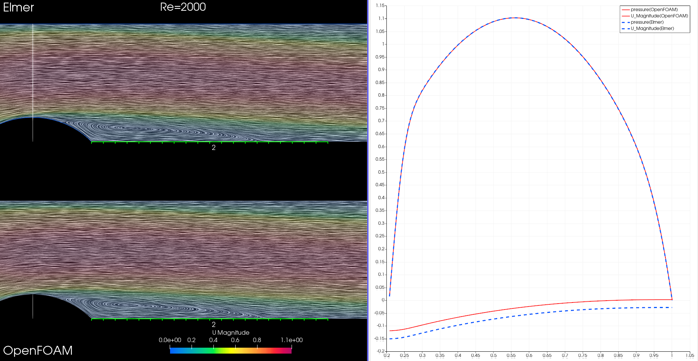
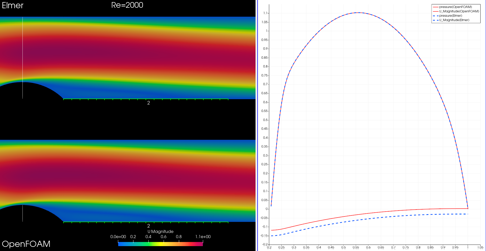

# 流体計算の妥当性検証，OpenFOAMとの比較

バンプがある流路の解析．


図は解析対象．


（雑なまとめである．）

## 解析対象と計算条件

長さ8m，幅1mの流路の2mから3mの位置にバンプを設置する．形状は円弧で半径はsqrt(2)/2とした．
詳しくは `bump.geo` ファイルを参照．

流入口を左の辺としてyを高さとして `4y(1-y)` で速度を与える（最大1の速度で2次関数で与えた）．

流出は右辺で速度のyの積分は0とした．

バンプ及び，上辺と下辺は速度0とした．

圧力はノイマン0境界条件とした．

流体はニュートン流体で非圧縮性を仮定する．密度は1とした．外力はないものとした．

粘性は1.0e-2，1.0e-3，1.0e-4とした．代表的な長さをバンプの始まりから終わりの長さの半分0.5で計算する．


ElmerModelマニュアルの24ページ目の2.2 Theoryを画像で載せる．

### 格子


格子はすべて4角形で88953個のものを用いた．等方的に設置し壁面を細かくする操作はしなかった．

### Re数とOpenFOAM

乱流モデルはなし．

Re=200，2000, Re=20000の3条件で計算する．比較対象としてOpenFOAMを使用した．格子は同じものを使用．線形ソルバの設定はなるべく同様な設定になるように近づけた．詳しくはソースコード参照．

### FEM(Elmer)における移流項の扱い

ElmerModelマニュアルの26ページを載せる．


ElmerのFEM計算において，移流項はじめ数ステップは前のステップで得られた速度uを既知として線形化した方程式を解く（式2.21）．これをピカールの逐次近似法からピカール反復と呼ぶことにする．ピカール反復が収束条件を満たしたら今度はより精密化したニュートン反復を行う．これは移流項を式2.22として計算する．

詳しくはsifファイルの設定参照．

#### sifファイルについて

本計算のSolver節についてコメント．

```
  Equation = Navier-Stokes ! NSの特殊性より必要キーワード。NS用に離散化される。
  Stabilization Method=Stabilized ! 必要。圧縮性ならBubble functionが使われる。上のスライドの行列。
  Steady State Convergence Tolerance = 1.0e-5 ! 定常問題なら必要。その判定。相対誤差。
  Nonlinear System Convergence Tolerance = 1.0e-8 ! ニュートン反復での収束判定。
  Nonlinear System Max Iterations = 20 ! そのままの意味。
  Nonlinear System Newton After Iterations = 3 ! ピカール反復を何回するか。
  Nonlinear System Relaxation Factor = 1 ! よく反復法関連で出てくる緩和係数みたいなやつ。
  Nonlinear System Newton After Tolerance = 1.0e-3 ! これ以下になったらニュートン反復する。
  Linear System Solver = Iterative ! 反復法で解く。小さい問題ならDirectでも良い。
  Linear System Symmetric = True ! NSから出てくる行列は対称ではないが既知の値を行列から除外したりゼロにして行列を対称化するか。
  Linear System Iterative Method = BicgstabL ! そのまま。
  BiCGStabl polynomial degree = 4 ! そのまま。以下略。
  Linear System Max Iterations = 500
  Linear System Convergence Tolerance = 1.0e-10
  Linear System Residual Output = 10 ! 残差を何回に1回出力するか。
  Linear System Preconditioning = ILU0
```

## 結果

特別問題はなかった．

### Re=200

t=0.825.


t=1.2.


t=5.0.


### Re=2000

t=11.25の画像を載せる．

LICによる流線による再付着点はおおよそ一致している．



圧力．積分定数分は問題ない．




### Re=20000

非定常性が強いのでt=10における比較とした．

全体．


LICによる流線．


圧力．


上辺にできる2次渦．


グラフによる比較．


圧力のグラフ．（Re=20000の計算の際はOpenFOAMと合わせて出口の圧力をゼロに固定した．）


## 計算速度

10ステップ。打切り残差tolerance=1.0e-12。シングルコア計算．

FEMとFVMの違いと使用する線形ソルバで大きく違いが出た．ElmerでCFDを行うのは時間的に難しい可能性がある．

### OpenFOAM

ソルバ：マルチグリッド法

前処理：対角ベース不完全 Cholesky 分解

```
real    0m22.068s
user    0m21.682s
sys     0m0.381s
```

ソルバ：前処理付き共役勾配法

前処理：対角ベース不完全 Cholesky 分解

```
real    1m17.236s
user    1m17.036s
sys     0m0.185s
```

### Elmer

ソルバ：安定化双共役勾配(l)法

前処理：不完全LU(3)分解

```
real    8m58.971s
user    8m57.969s
sys     0m0.517s
```

## コメント

一致しているからと言ってナヴィエ・ストークス方程式が解けているとは全く言えないことに注意．特にRe=20000は境界層への考慮が必要だろうと思う．DNSが出来る格子サイズではないだろう．

